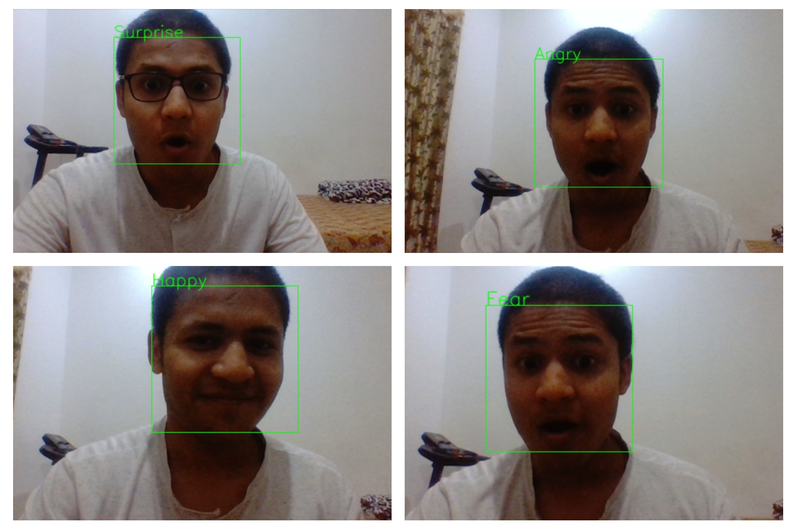

# DeepFace-Emotion-Detection

A Face Emotion recognizer using CNN and Keras.

# Features
- 63% accuracy on FER2013 .
- Applied `OpenCV` to clip face area
- Built a CNN classifier using `Keras`

# How to get the dataset?
[2013 Kaggle FER](https://www.kaggle.com/c/challenges-in-representation-learning-facial-expression-recognition-challenge/data)

